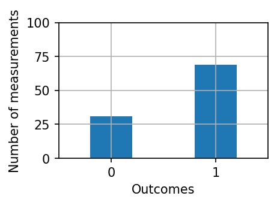

# GTLP

As a PhD student at the University of Alberta, I participated in the [Graduate Teaching and Learning Program](https://www.ualberta.ca/graduate-studies/professional-development/graduate-teaching-and-learning-program/index.html) (GTLP). This program is designed to help graduate students learn and engage with best practices and the scholarship of teaching, learning, and course design. It supports graduate students in their development as educators and future primary instructors.

:small_orange_diamond: I have completed Levels 1, 2, and 3 of GTLP.

___

The following are several artifacts from my participation in GTLP Level 3, produced between January to April 2022:

##### Course Outline & Syllabus: Quantum Mechanics and You

In GTLP Level 3, I designed and outlined a university course for incoming freshman students from all over campus. Throughout this process I considered various situational factors of students.



Despite being the center of some of the “hottest” and most disruptive advancements of the 21st century, quantum mechanics has the reputation of being sterile, esoteric, and incomprehensible for the average human being. In truth, however, many of the problems people perceive in learning quantum mechanics stem from the language used to describe it and the apparent lack of meaningful associations.

In its essence, quantum mechanics is the set of principles describing the physical nature of the universe’s smallest bits of matter and energy. Discovering these rules, and applying them to make powerful predictions have - in a large part - enabled our modern world, and will continue to transform the human experience.

Quantum mechanics is currently at a watershed moment. Never before have there been so many accessible learning resources and real-world applications and opportunities. This course represents an attempt to open these learning opportunities to a wider audience. It is based on the assumption that anyone with interest and dedication can appreciate and begin to learn quantum mechanics. This course is organized in modules around (1) various quantum mechanical principles and (2) their applications, without getting into heavy mathematical formalisms.



1. Expand knowledge of fundamental quantum mechanical principles that undergird so much of modern life and technology.
1. Foster wider interest in and engagement with quantum and physical sciences.
1. Contextualize upcoming 21st-century developments with quantum technologies.



1. **Describe** and **differentiate** between scientific fact, law, hypothesis, and theory.
1. **Examine** and **appraise** scientific data, claims, and concepts for making wise decisions affecting themselves and others.
1. **Explain** foundational quantum principles such as discreteness, superposition, probability, and entanglement. 
1. **Identify** applications and operations of these principles in a variety of modern and future technologies.
1. **Calculate** physical quantities that are relevant to these applications.
1. **Distinguish** the operation and capabilities of classical and quantum computers.
1. **Assess** the social and ethical implications of upcoming quantum technologies.
1. **Express** and reflect on quantum mechanical ideas, applications, or open questions in writing and other formats.



The complete outline and syllabus for this course, as it would be taught at the University of Alberta during Fall 2021 semester, can be viewed [here](course_outline.pdf).

##### Assignment and Rubric
The culminating project of PHYS 111 is an UnEssay, an open-ended project where students engage with the course material in a personally meaningful way. Students select a topic related to the course material that interests them, research it, and then represent their findings in a creative manner[^1].

I have designed this course to scaffold student success. Early on in the semester, they complete the following assignment as they begin to think about and plan for the final project.



### Assignment

_The Topic Selection Document is the first step in the UnEssay course project. Write a short, five paragraph written description of your intended UnEssay topic and your plan for how it will be represented. Also, include at least three relevant and properly referenced sources to be consulted throughout the research process. Along with each source, include a brief annotated summary of the main ideas, results, and conclusions along with a critical assessment of the source’s quality and reliability._

_The purpose of this assignment is to begin crafting a goal and a solid plan for successfully completing the UnEssay. It’s to help you start to organize your ideas and source material. You may find you need to do even more research on your chosen topic after completing this assignment. That’s ok. You are not even necessarily committed to your goal and plan; these will not be compared against your final submission._

### Targeted Intended Learning Outcomes:
* **Examine** and **appraise** scientific data, claims, and concepts for making wise decisions affecting themselves and others.
* **Express** and **reflect** on quantum mechanical ideas, applications, or open questions in writing and other formats.


The single-point rubric I created for assessing the Topic Selection Document is available [here](rubric.pdf). 

##### Multiple Choice Quiz
To engage with best practices of multiple choice assessment, I wrote the following three questions. While some of these questions have numerical answers, they are conceptual or assess idenfication and recall. 

These and similar questions would appear on one of the three principles quizes taken by PHYS 111 students throughout the semester.


Q: A qubit is repeatedly prepared in the superposition $|\psi\rangle = \left(|0\rangle - |1\rangle\right) / \sqrt{2} $ and measured. The results of the last ten measurements are $ \{0, 1, 1, 1, 0, 1, 1, 0, 1, 1\} $. What is the probability that the next measurement will be $ 1$?

a) 0.7
 
b) 0.5 :heavy_check_mark:

c) 0.3

d) 0.1



Many scientists studying the spectrum of heated objects observed a continuous spectral curve that peaks, and also shifts to shorter wavelengths as the objects’ temperature increases. What is the proper term for these observations of the spectrum?

a) Scientific facts :heavy_check_mark:
 
b) Scientific theories

c) Scientific hypotheses

d) Scientific explanations



After 100 identical preparations and measurements of a qubit, Jane measured the states $ |0 \rangle $ and $ |1 \rangle $ with probabilities shown in the following graph. 

What is the most likely amplitude of the $ |1 \rangle $ state?

a) $ \sqrt{3} / 2 $ :heavy_check_mark:
 
b) $ 1 / \sqrt{2} $

c) $ 3 / 4 $

d) $ 1 / 4 $


##### Microteaching Challenge
For the microteaching challenge, I designed and delivered a lesson plan which follows best practices of scholarly teaching and learning, all within a compressed, five-minute time frame. The goal was to present the very first class session of PHYS 111: teaching a single concept and giving a flavor of what the course would be like.

Included below are two peer feedback letters commenting on my microteaching presentation:
* [Feedback letter #1](feedback1.pdf)
* [Feedback letter #2](feedback2.pdf)

[^1]: Mark Kissel, “The UnEssay,” [https://marckissel.netlify.app/post/on-the-unessay/](https://marckissel.netlify.app/post/on-the-unessay/), accessed April 28, 2022.

